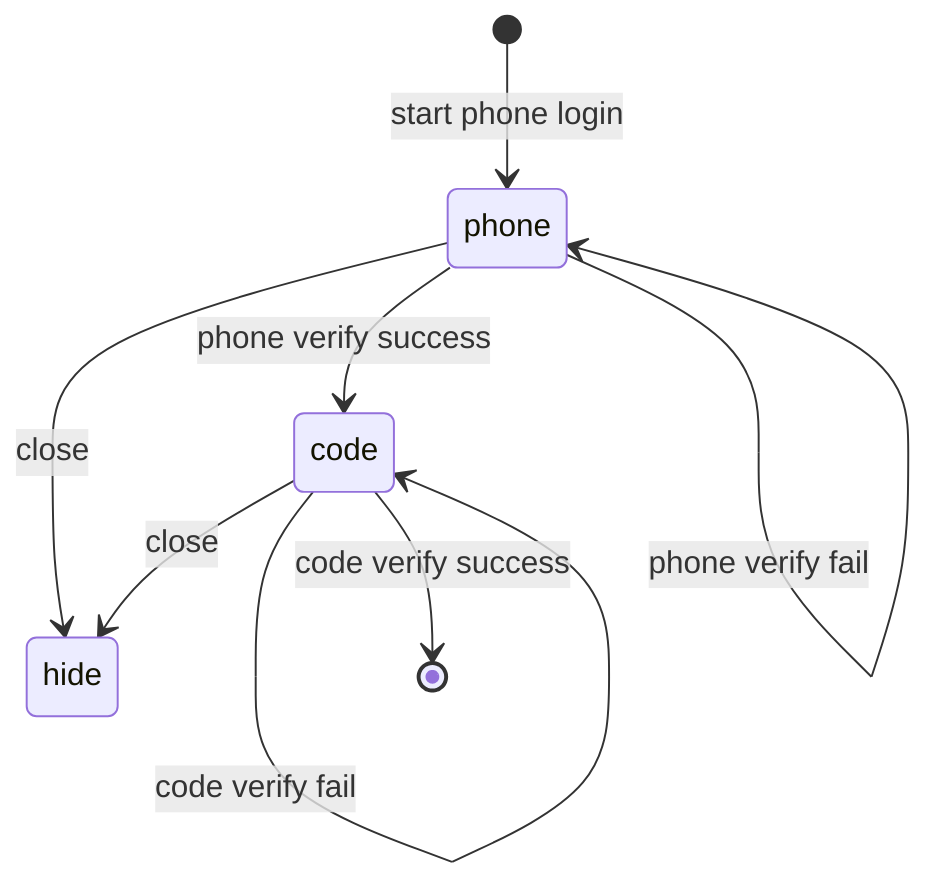

- 👋 Hi, I’m @fengpu-ischool

<!---
fengpu-ischool/fengpu-ischool is a ✨ special ✨ repository because its `README.md` (this file) appears on your GitHub profile.
You can click the Preview link to take a look at your changes.
--->

state
* currentPad: 'phone' | 'code' | 'closed' | 'success'
* phoneError: string
* codeError: string
* currentPhone: string
* currentCode: string
* country code: string
* last code sent time: datetime

action
* start phone login
* close
* phone verify success
* phone verify fail
* code verify success
* code verify fail
* code resend
